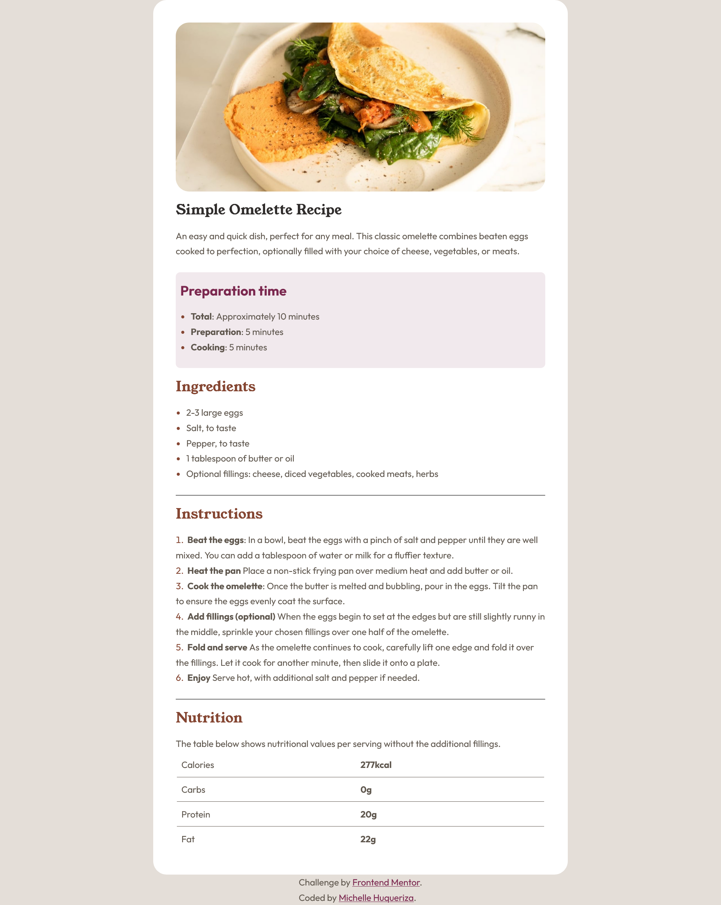
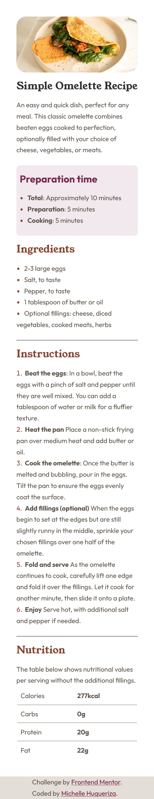

# Frontend Mentor - Recipe page solution

This is a solution to the [Recipe page challenge on Frontend Mentor](https://www.frontendmentor.io/challenges/recipe-page-KiTsR8QQKm).

## Table of contents

- [Overview](#overview)
  - [Screenshot](#screenshot)
  - [Links](#links)
  - [Built with](#built-with)
- [Author](#author)
## Overview

### Screenshot

### Links

- [Solution URL](https://github.com/Michellewhat/Frontend-Mentor-Projects/tree/main/recipe-page-main)
- [Live Site URL](https://michellewhat.github.io/recipe-page-main/)

### Built with

- Semantic HTML5 markup
- CSS custom properties
- Flexbox

## Author

- Frontend Mentor - [@Michellewhat](https://www.frontendmentor.io/profile/Michellewhat)
